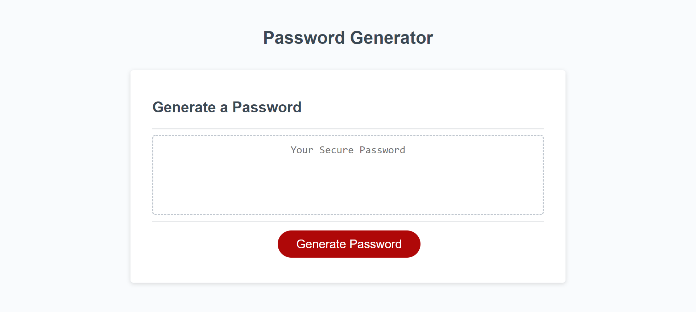
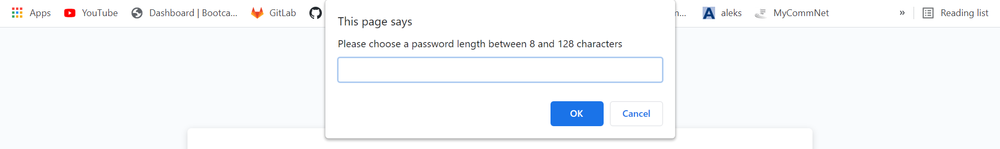
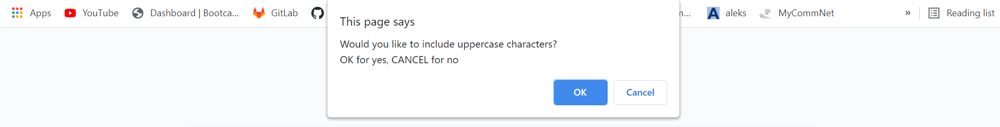

# Password-Generator

## Description

* I wanted to make a password generator that allows the user to choose the criteria they want for their password

* The application isn't quite finished yet but you can see the general funcionality that it contains

* The user will be able to choose a password length and specify if they want lowercase, uppercase and special characters

* It has been a great challenge to prompt the user with this criteria and then include that criteria in the generated password

* In the future I will finish up the code in order to accurately generate password given the chosen criteria

## Table of Contents
[Installation](#installation)
[Usage](#usage)
[Credits](#credits)
[License](#license)

## Installation

Follow these steps to create a local copy of this repository so you can edit too!
1. Navigate to https://github.com/stevecarofano/Password-Generator
    
2. Find the green **Code** button on the right-hand side, click it and copy the repository URL with HTTPS or SSH keys
    
3. Open the command line or terminal on your machine and navigate to the destination you want the files to live in
    
4. Type git clone _pasteURLhere_
    
5. Hit Enter
    
6. Congratulations! You now have a local copy of this repository and you can make your own changes to it!

## Usage

As I mentioned, this application isn't completely finished yet, but you can still try it out and see the general functionality
and very soon you will be able to generate your very own unique password!

Find the red Generate Password button at the bottom of the page:
    
    
Then click it to see a series of prompts about your password criteria:

This one asks the user what length they would like for the password:
    

This one (and the following prompts) ask the user to specify which character types they would like to include in the password:
    
    

## Credits
This was a solo project but I found some helpful resources online

[w3schools window prompts](https://www.w3schools.com/jsref/met_win_prompt.asp)

[w3schools JavaScript functions](https://www.w3schools.com/js/js_functions.asp)

## License 

MIT License

Copyright (c) [2021] [stevecarofano]

Permission is hereby granted, free of charge, to any person obtaining a copy
of this software and associated documentation files (the "Software"), to deal
in the Software without restriction, including without limitation the rights
to use, copy, modify, merge, publish, distribute, sublicense, and/or sell
copies of the Software, and to permit persons to whom the Software is
furnished to do so, subject to the following conditions:

The above copyright notice and this permission notice shall be included in all
copies or substantial portions of the Software.

THE SOFTWARE IS PROVIDED "AS IS", WITHOUT WARRANTY OF ANY KIND, EXPRESS OR
IMPLIED, INCLUDING BUT NOT LIMITED TO THE WARRANTIES OF MERCHANTABILITY,
FITNESS FOR A PARTICULAR PURPOSE AND NONINFRINGEMENT. IN NO EVENT SHALL THE
AUTHORS OR COPYRIGHT HOLDERS BE LIABLE FOR ANY CLAIM, DAMAGES OR OTHER
LIABILITY, WHETHER IN AN ACTION OF CONTRACT, TORT OR OTHERWISE, ARISING FROM,
OUT OF OR IN CONNECTION WITH THE SOFTWARE OR THE USE OR OTHER DEALINGS IN THE
SOFTWARE.

